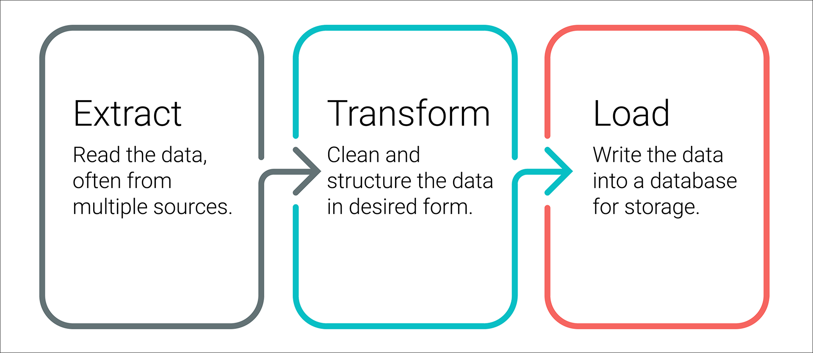
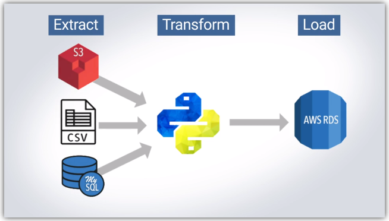
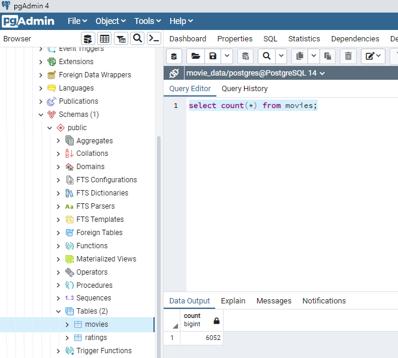
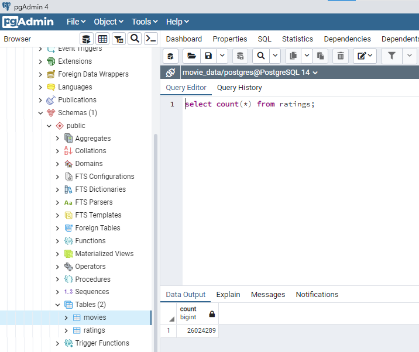

# Movies-ETL
In this project we perform the ETL process.

# Election_Analysis
Performing Analysis on Election data in Colorado. 

## Table of Contents
- [Overview of Project](#OverviewProject)
  * [Background](#Background)
  * [Purpose](#purpose)
- [Extract](#extract)
- [Transform](#transform)
- [Load](#load)
- [Resources](#resources)
- [References](#references)

## Overview of Project
### Background
Raw data exists in multiple places and needs to be cleaned and structured before it can be analyzed. ETL breaks this problem into three steps, or phases: Extract, Transform, and Load. 

  
 

**Extract:** 
In the Extract phase, data is pulled from external or internal sources, possibly disparate. The sources could be flat files, scraped webpages in HTML or JavaScript Object Notation (JSON) format, SQL tables, or even streams of sensor data.

**Transform:**  
In the Transformation phase the data may need to be filtered, parsed, translated, sorted, interpolated, pivoted, summarized, aggregated, merged, or more. The transformation phase can be accomplished with Python and Pandas, pure SQL, or specialized ETL tools like Apache Airflow or Microsoft SQL Server Integrated Services (SSIS).

**Load:**  
Finally, after the data is transformed into a consistent structure, it's loaded into the data target. The data target can be a relational database like PostgreSQL, a non-relational database like MongoDB that stores individual documents, or a data warehouse like Amazon Redshift that optimizes performance specifically for analytics. 

  
 

### Purpose

**Amazing Prime Video** is a platform for streaming movies and TV shows and is one of the world's largest online retailer. It would like to develop an algorithm to know which low budget movies will become popular so that they can buy the streaming rights at a bargain. For this purpose they are organizing a hackathon where teams of analysts would collaborate to work intensively on this project. 

My task is to create a clean dataset for the hackathon participants to use. There are 2 data sources : 
1. **Wikipedia** for all movies released since 1990 
2. **Rating data** from the MovieLens website. 

The goal of this analysis is to create an automated pipeline that follow the ***ETL process***: 
1. **Extract:-** the **Wikipedia and Kaggle data** from their respective files
2. **Transform** the datasets by cleaning them up and joining them together 
3. **Load** that cleaned and structured dataset to a SQL table. 

We are using **Jupyter notebooks, Python, Pandas,Regex** for cleaning and merging the dataset and then load the cleaned dataset into the SQL database - **PostgreSQL** for further analysis. 

## Extract

In the Extract phase we will extract the scraped Wikipedia data stored as a JSON, and Kaggle data stored in CSVs. The below link contains the code pertaining to this process.

[ETL_function_test.ipynb](Challenge/ETL_function_test.ipynb)  

 1. Read the **Kaggle data** and the **Ratings data** from the **csv** into a Pandas dataframe.
 2. The **Wikipedia data** is in the **JSON format**, hence we read the JSON file and store it in a Pandas dataframe.

## Transform

The transform step is largely spent on data cleaning. We will use Python and Pandas to explore, document, and perform our data transformation. The below link contains the code for cleaning the Wiki data and the Kaggle data.

[ETL_clean_wiki_movies.ipynb](Challenge/ETL_clean_kaggle_data.ipynb)  
[ETL_clean_kaggle_data.ipynb](Challenge/ETL_clean_kaggle_data.ipynb)  

Below are the few steps we have followed to clean the data:
1. We dropped the columns with 90% null values.
2. Changed the data types of the columns
3. Dropped the redundant columns, merged few columns containing data and changed the column names to more meaningful names.
4. Parsed the data using Regex, and retrieved meaningful information from the columns.
5. Finally merged the Wiki and Kaggle data to get the movies dataset.

## Load
Finally, we'll be loading our data into a PostgreSQL table. We create the connection to the PostgreSQL database by **sqlalchemy library** and **to_sql** method. The complete ETL process is accomplished by executing the function **extract_transform_load** in the coode below. 

[ETL_create_database.ipynb](Challenge/ETL_create_database.ipynb)

 
## Summary

After performing the ETL process, the cleaned and structured data is stored in 2 tables in PostgreSQL:

* **movies** -- This conatins the information pertaining to the movies like- title, director, producer and much more

  
 

* **ratings** -- This contains the ratings for all the movies.

  
 

##  Resources
[1] [Wikipedia webscrape data - in JSON format](wikipedia-movies.json)  
[2] [Kaggle Data](archive/movies_metadata.csv) from   
[3] [Ratings Data](archive/ratings.csv)   

[4] Software: 
* Python 3.10.2
* Visual Studio Code 1.64.2
* PostgreSQL and PgAdmin  

[5] Dependencies:
* Pandas
* Regex
* Numpy
* Sqlalchemy

##  References

[All about Regex](https://courses.bootcampspot.com/courses/1154/pages/8-dot-3-9-write-regular-expressions?module_item_id=475619) 
[Lambda Functions](https://realpython.com/python-lambda/)

